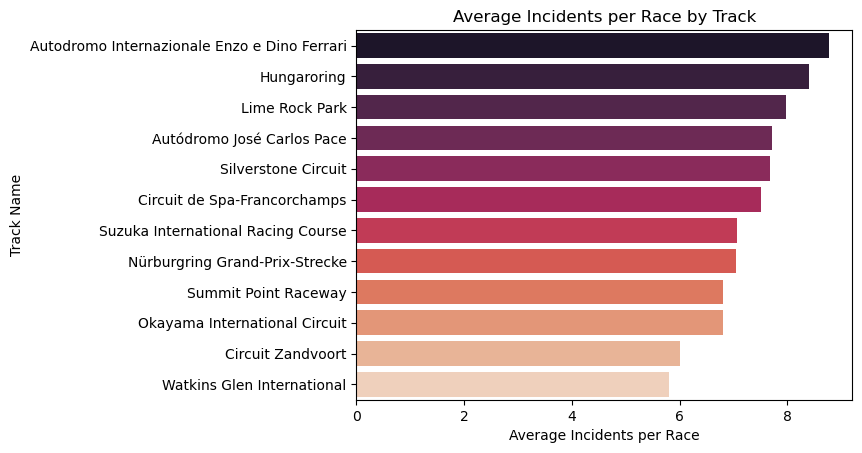
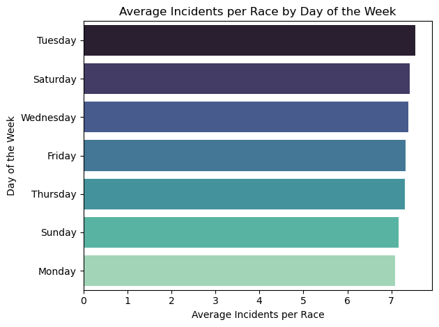
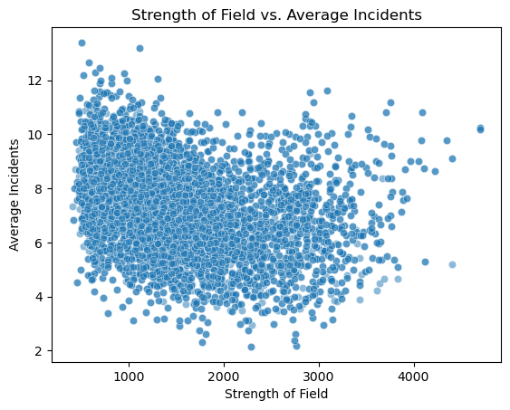
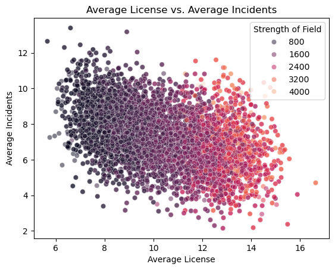
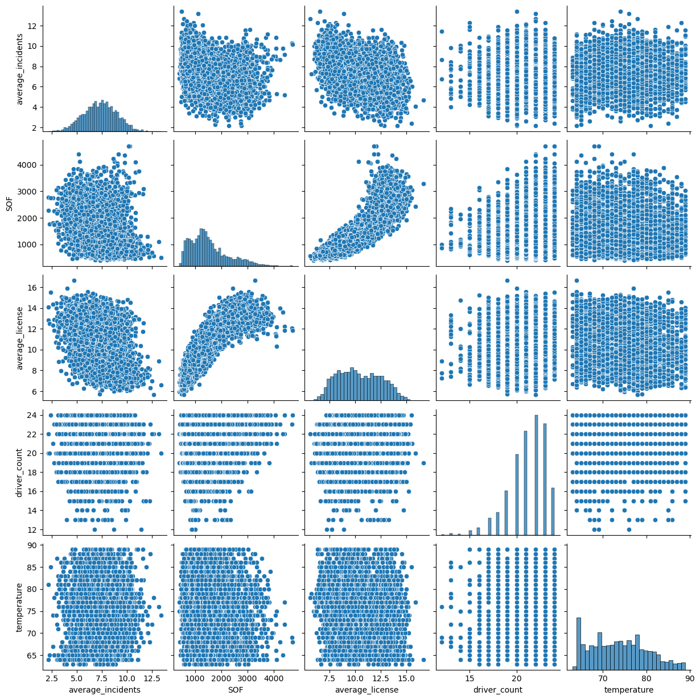
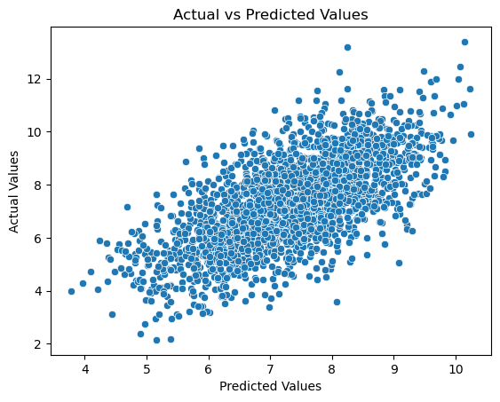
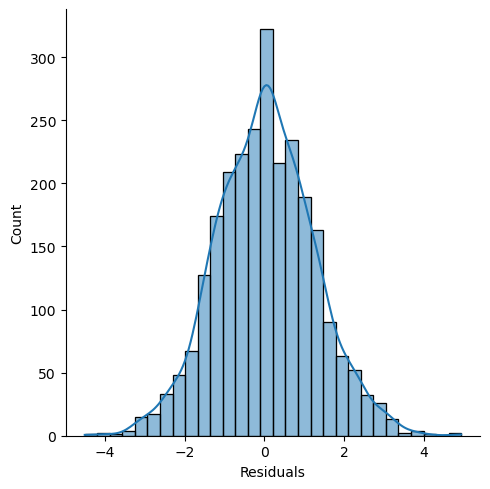
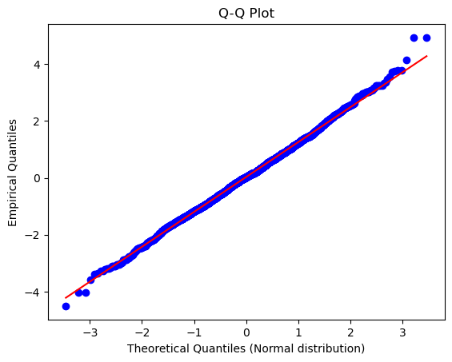

# Introduction
This project attempts to predict the average incident count of a given race in the popular motorsport simulation iRacing. Incident points are the penalty system used in iRacing for penalizing car to car contact or driving off track. The results of this project can be used to identify external factors that contribute to clean and fair wheel-to-wheel racing.

# Background

In competitive motorsport simulation, understanding the factors that contribute to clean and fair racing is essential for enhancing the player experience. iRacing, the industry standard for motorsport simulation, uses a penalty system to enforce clean racing. Incident points are assigned during a race session for collisions, off-track excursions, and other infractions.

This project aims to predict the average incident count in iRacing race sessions using multiple linear regression. By analyzing factors such as driver attributes, track characteristics, and race conditions, the project seeks to identify the key contributors to higher or lower incident counts. Gaining insight into these factors can help league organizers and developers implement strategies to improve race quality and fairness on the platform.

# Data Acquisition
The dataset for this project contains statistics for every race result from the 2023 season 4 of the FIA Formula 4 series on iRacing. 

The data for this project was pulled from the iRacing data API using the Python wrapper linked [here](https://github.com/jasondilworth56/iracingdataapi). To create the dataset I wrote several functions to perform multiple api calls and aggregate the retrieved data into a single Pandas Dataframe. The code for data acquisition can be found [here](https://github.com/bennettrh/IRacing_Incident_Prediction/blob/main/Data_Acquisition.ipynb).

## Variables
- **Subsession ID:** Unique ID assigned to every race session. Useful as an argument for performing further api calls in the event you wish to add data specific to a given race session. 
- **Track Name:** The name of the track the session took place on. iRacing tracks rotate on a weekly basis over the course of a 12 week season.
- **Track ID:** The unique ID associated with a track. Useful for matching track specific data retrieved from API calls. 
- **Driver Count:** The total number of drivers racing in a given subsession. 
- **Week Number:** The number identifying which week of the 12 week season a session took place during. Ranges from 0-11. 
- **date:** The date the session took place on.
- **SOF:** Strength of field, indicating the average irating of a given race session. irating is used by iRacing to measure the skill level of a driver. 
- **Lead Changes:** The number of times the leader of the race changed over the course of a given race. 
- **Average Incidents:** The average number of incident points accumulated over the course of a race session. This will be the dependent variable in the model.
- **Track Length:** The length of the track.
- **Track Corners:** The number of corners the track has. 
- **Free Track:** Whether the track is included in the base iRacing subscription. 
- **Day of Week:** Which day of the week the session took place. The iRacing week starts on Tuesday and ends on Monday, with the track changing every week. 
- **Average License:** The average license of the drivers in a given subsession. iRacing uses a license system to determine which races a driver can participate in. The less incident points a driver accumulates the higher their license will be. Higher number indicates a safer driver. 
- **Temperature:** The temperature of the given race session. Temperature can greatly affect how difficult the driving conditions are. 

# Exploratory Data Analysis and Feature Selection

Code for the remaining sections can be found [here]().

## Data Overview
|   | subsession_ID | track_name                    | track_id | driver_count | week_num | date                       | SOF  | lead_changes | average_incidents | track_length | track_corners | free_track | day_of_week | average_license | temperature |
|---|---------------|-------------------------------|----------|--------------|----------|----------------------------|------|--------------|-------------------|--------------|---------------|------------|-------------|----------------|-------------|
| 0 | 63655736      | Okayama International Circuit  | 166      | 22           | 0        | 2023-09-12 01:45:00+00:00   | 2781 | 0            | 4.909091           | 2.314        | 11            | True       | 1           | 14.045455       | 74          |
| 1 | 63655737      | Okayama International Circuit  | 166      | 21           | 0        | 2023-09-12 01:45:00+00:00   | 1757 | 2            | 4.190476           | 2.314        | 11            | True       | 1           | 12.666667       | 74          |
| 2 | 63655738      | Okayama International Circuit  | 166      | 21           | 0        | 2023-09-12 01:45:00+00:00   | 1559 | 0            | 5.904762           | 2.314        | 11            | True       | 1           | 13.142857       | 74          |
| 3 | 63655739      | Okayama International Circuit  | 166      | 21           | 0        | 2023-09-12 01:45:00+00:00   | 1354 | 1            | 8.666667           | 2.314        | 11            | True       | 1           | 10.666667       | 74          |
| 4 | 63655740      | Okayama International Circuit  | 166      | 21           | 0        | 2023-09-12 01:45:00+00:00   | 1203 | 0            | 9.619048           | 2.314        | 11            | True       | 1           | 10.809524       | 74          |

Shown above are the first 5 rows of the dataset, allowing us to visualize any necessary cleanup.
-  Date can be dropped because using it in the model would make generalizing it to other 12 week iRacing seasons difficult. The effect of date may be stronger if the season of interest is duirng the holidays than if it is in the middle of the summer. Day of week will be converted from an integer to a string for the sake of clarity as well. 

- Track specific factors (track length, track corners, free track, and week number) can all be dropped as well. These variables will always be the same for a specific track so their effects will be captured by track_name alone. Including them would be redundnant and would induce perfect multicollinearity. 

- Lead Changes should be dropped as well. Given the goal is predicting the average number of incidents, using a variable that is only available after the race is completed is unrealistic. If the primary goal was identifying factors that contribute to average incidents then including lead changes would be reasonable. 

## Summary Statistics

|       | driver_count | SOF         | average_incidents | average_license | temperature |
|-------|--------------|-------------|-------------------|-----------------|-------------|
| count | 8575.000000  | 8575.000000 | 8575.000000       | 8575.000000     | 8575.000000 |
| mean  | 21.151487    | 1525.663790 | 7.318861          | 10.402733       | 73.655860   |
| std   | 2.013780     | 725.214854  | 1.642387          | 2.068108        | 6.648384    |
| min   | 12.000000    | 401.000000  | 2.150000          | 5.652174        | 63.000000   |
| 25%   | 20.000000    | 995.000000  | 6.190476          | 8.695652        | 68.000000   |
| 50%   | 21.000000    | 1375.000000 | 7.347826          | 10.227273       | 73.000000   |
| 75%   | 23.000000    | 1897.500000 | 8.454545          | 12.047619       | 78.000000   |
| max   | 24.000000    | 4706.000000 | 13.400000         | 16.650000       | 89.000000   |

Above are the summary statistics for numerical variables of interest. 

- Driver count does not vary much around its mean, with most races having a consistent number of drivers. There may be some outliers on the low end with the lowest driver count being 12 drivers. 

- Strength of Field varies greatly across sessions.

- Average License varies moderately however most races center around 10. This is consistent with the race series having a specific license requirement to being with. If this were re-run on series with higher license requirements the variance would be notably lower. 

- Temperature varies greatly within a specific range but this is to be expected given different tracks are located in different climates. 

- Average incident count does not vary significantly around the mean. The standard deviation of 1.64 will serve as a useful benchmark for our model's predictive capabilites. 

## Data Visualization
### Track Choice

*Bar Graph visuzalizing the average incident count for a given track*

From the graph it is apparent that track choice has a great impact on the average incident count of a given race. This is expected given tracks vary greatly in difficulty, length, track-limit scrutiny, etc. This variation makes track name a strong candidate in variable selection for our model. 

### Day of the Week

*Bar Graph visualizing the average incident count for each day of the week*

Given the iRacing week starts on Tuesday and ends on Monday, one would expect incidents to be highest on Tuesday and lowest on Monday as drivers become accustomed to the track over the course of the week. This is confirmed by the bar graph, although the magnitude of this effect appears to be rather small. 

### Strength of Field 

*Scatterplot visualizing how strenght of field affects average incident count*

Given strength of field is a measure of driver skill, one would assume that a higher strenght of field would correlate to a lower incident count. There does appear to be a slight negative correlation between the two offset by a few outliers. 

### Average License Level

*Scatterplot visualizing how the average license level of drivers in a race affects incident count. In addition, strenght of field is visualized as a hue, with lighter colors indicating higher SOF*

Average license level is a more direct measurement of driver safety. One would expect a higher license level to correlate with fewer incidents, and the scatterplot above agrees with this prediction.

In addition, it appears that strength of field is highly correlated with license level, with higher average license levels generally corresponding to a higher strenght of field. This may cause issues with multicollinearity, but this will only affect statistical inference of coefficients and not prediction accuracy. 

### Multicollinearity Check

*Scatterplot matrix to check for correlation between all variables, with the distributions of each individual variable plotted on the diagonal*

The above scatterplot matrix confirms the high correlation observed earlier between strength of field and average license level. It also shows no significant visual relationship between average incidents and driver count or average incidents and temperature. 

# Model, Predictions, and Results

## Model
The model I am using to predict average incident count in a given race is a multiple linear regression model.

- **Dependent Variable:** Average Incident Count
- **Independent Variables:** SOF, Average License, Temperature, Driver Count, day of week, track name

Although temperature and driver count did not appear to have a significant relationship with incident count, including them in the model can only help even if just marginally. Given the large sample size we have plenty of degrees of freedom to spare without risking overfitting. 

Day of the Week and Track Name were coded as dummy variables, with one category for each being used as a base category to avoid perfect multicollinearity. 

Aditionally I have added an interaction term between SOF and Average License, denoted as **SOF*License**. License level may have a weaker effect at higher strengths of field as drivers at that higher SOF likely all have higher license levels to begin with. This interaction term aims to capture this effect. 

## Methodology
The model was fit using the SciKit-Learn package in Python. The data was split into training and testing samples, with 70% used to train the model and 30% used for testing. 

## Results
Running the model on the test data and plotting the predictions versus the actual values yielded the below scatterplot: 

*Scatterplot of the actual observed values versus the values predicted by the model using the test data*

Visually the model does a decent job of predicting average incident count, with a broad linear relationship visible between the actual and predicte values. 

Looking at relevant metrics for model assessment provides further insight: 
|                          | Values    |
|---------------------------|----------|
| Mean Absolute Error        | 0.966231 |
| Root Mean Squared Error    | 1.227426 |
| R²                         | 0.453593 |

- **Mean Absolute Error and Root Mean Squared Error** determine how far off the prediction is on average. The root mean square error penalizes outliers heavier by squaring the residual in the calculation. This means that on average, the model is .97 - 1.23 incidents off in prediction.

- **R^2** can be interpreted as what percent of the phenomenon we are trying to explain is explained by our model. In this case, our model explains roughly 45% of the dependent variable. 

## Further Interpretation
- If we were to predict average incident count using the mean of the average incident count, the standard deviation could be interpreted as the root mean square error. Given the standard deviation of 1.64, our model predicts roughly 25% better than the mean. Given the average incident count is already closely centered around the mean, this is a meaningful improvement. 

- Incidents in races are highly stochastic. Very minor driving errors such as dipping a wheel on to the grass at the wrong time can cause a multi-car collision. Server issues can cause collisions between two cars that would have otherwise never collided at no fault of either user. Given the randomness involved in incidents, being able to explain 45% of the phenomenon is signficant. 

## Residuals Normality Testing

In order to assess the validity of the model we need to confirm that the errors (residuals) follow a normal distribution. 

### Histogram

The histogram below confirms that the residuals follow a normal distribution, meaning the errors made by the model are random. 

*Histogram visualizing the distribution of the residuals*

### Q-Q Plot

To further confirm the normality of the residuals, we can create a Q-Q Plot which plots the quantiles of the residuals against the theoreitcal quantiles of a normal distribution. 

*Q-Q Plot visualizing the quantiles of the residuals agains the quantiles of a normal distribution*

This further confirms normality but also identifies some potential outliers in both the upper and lower tails of the graph. Further investigation and handling of these outliers, whether through removal or use of robust regression techniques, could improve model performance. 
 

# Statistical Inference

Re-running the model using the Statsmodels package provides the necessary output for statistical inference on the coefficients of the independent variables. 

### OLS Regression Results

| **Statistic**                  | **Value**            |
|---------------------------------|----------------------|
| **Dep. Variable**               | average_incidents    |
| **R-squared**                   | 0.458                |
| **Adj. R-squared**              | 0.456                |
| **F-statistic**                 | 240.3                |
| **Prob (F-statistic)**          | 0.00                 |
| **No. Observations**            | 6002                 |
| **Df Residuals**                | 5980                 |
| **Df Model**                    | 21                   |
| **AIC**                         | 1.930e+04            |
| **BIC**                         | 1.945e+04            |
| **Log-Likelihood**              | -9627.8              |
| **Covariance Type**             | nonrobust            |

---

#### Coefficients

| **Variable**                                  | **Coef.** | **Std Err** | **t**     | **P-value** | **[0.025** | **0.975]** |
|-----------------------------------------------|-----------|-------------|-----------|-------------|------------|------------|
| const                                         | 10.5041   | 0.380       | 27.645    | 0.000       | 9.759      | 11.249     |
| driver_count                                  | 0.0905    | 0.009       | 10.559    | 0.000       | 0.074      | 0.107      |
| SOF                                           | 0.0004    | 4.29e-05    | 10.062    | 0.000       | 0.000      | 0.001      |
| average_license                               | -0.4878   | 0.015       | -32.582   | 0.000       | -0.517     | -0.458     |
| temperature                                   | 0.0098    | 0.004       | 2.251     | 0.024       | 0.001      | 0.018      |
| track_name_Autódromo José Carlos Pace         | -0.9686   | 0.081       | -11.917   | 0.000       | -1.128     | -0.809     |
| track_name_Circuit Zandvoort                  | -2.6121   | 0.087       | -30.074   | 0.000       | -2.782     | -2.442     |
| track_name_Circuit de Spa-Francorchamps       | -1.0968   | 0.070       | -15.775   | 0.000       | -1.233     | -0.960     |
| track_name_Hungaroring                        | -0.4718   | 0.097       | -4.877    | 0.000       | -0.661     | -0.282     |
| track_name_Lime Rock Park                     | -1.1240   | 0.076       | -14.714   | 0.000       | -1.274     | -0.974     |
| track_name_Nürburgring Grand-Prix-Strecke     | -1.4557   | 0.087       | -16.686   | 0.000       | -1.627     | -1.285     |
| track_name_Okayama International Circuit      | -2.0976   | 0.086       | -24.340   | 0.000       | -2.267     | -1.929     |
| track_name_Silverstone Circuit                | -1.0168   | 0.076       | -13.328   | 0.000       | -1.166     | -0.867     |
| track_name_Summit Point Raceway               | -2.2202   | 0.078       | -28.420   | 0.000       | -2.373     | -2.067     |
| track_name_Suzuka International Racing Course | -1.3451   | 0.081       | -16.606   | 0.000       | -1.504     | -1.186     |
| track_name_Watkins Glen International         | -2.7788   | 0.080       | -34.705   | 0.000       | -2.936     | -2.622     |
| day_of_week_Monday                            | -0.2355   | 0.060       | -3.908    | 0.000       | -0.354     | -0.117     |
| day_of_week_Saturday                          | -0.0062   | 0.057       | -0.109    | 0.913       | -0.118     | 0.106      |
| day_of_week_Sunday                            | -0.2020   | 0.057       | -3.557    | 0.000       | -0.313     | -0.091     |
| day_of_week_Thursday                          | -0.0151   | 0.059       | -0.254    | 0.800       | -0.132     | 0.101      |
| day_of_week_Tuesday                           | 0.3893    | 0.060       | 6.508     | 0.000       | 0.272      | 0.507      |
| day_of_week_Wednesday                         | 0.1182    | 0.059       | 1.998     | 0.046       | 0.002      | 0.234      |

---

#### Model Statistics

| **Statistic**                | **Value**  |
|------------------------------|------------|
| **Omnibus**                  | 8.093      |
| **Prob(Omnibus)**            | 0.017      |
| **Durbin-Watson**            | 1.976      |
| **Jarque-Bera (JB)**         | 8.075      |
| **Prob(JB)**                 | 0.0176     |
| **Skew**                     | 0.089      |
| **Kurtosis**                 | 3.020      |
| **Cond. No.**                | 4.19e+04   |

## Interpretation

- **Statistical Significance:** Based on P-Values alone, all variables are statistically significant at a 5% significance level with the exception of the Saturday and Thursday dummy variables. 

- **Coefficient Interpretation:** Looking at coefficient estimates, the variables with the greatest effect are the track dummy variables. Difference in the track often affects the average incident count by 1-2 incidents. The individual coefficients for each track can help developers identify problematic tracks and assess design elements contributing to high incident counts. 

- **Multicollinearity:** The high condition number indicates multicollinearity. This likely stems from the high correlation between strength of field and average license level, further confirmed by the inflated standard error of SOF. While this does not affect the model's predictive capabilities, it makes it difficult to accurately interpret the coefficients for strength of field and average license level. 

# Conclusion 

This project developed a multiple linear regression model to predict the average incident count in iRacing race sessions. Key variables such as strength of field, average license level, track choice, race conditions, and day of the week helped explain around 45% of the variation in incident counts. While this reflects the model’s ability to capture significant trends, it also highlights the inherent randomness in race incidents.

Track choice was the strongest predictor of incidents, with certain tracks generating consistently higher counts. Higher license levels and stronger fields typically led to fewer incidents, indicating cleaner racing among more skilled drivers.

The model achieved a prediction error of 0.97 to 1.23 incidents on average depending on the measure used, though residual analysis identified some outliers that may contribute to this. Future improvements could involve exploring non-linear models or other machine learning techniques to capture more complex interactions. Furthermore, expanding the dataset by including a full year of racing in a given series versus one season could potentially improve fit and allow for the inclusion of date-sensistive variables on a scale larger than day of the week. 

Overall, this project provides useful insights into the factors contributing to cleaner racing in iRacing. These findings can help developers and league organizers implement strategies to improve race quality and fairness on the platform.
